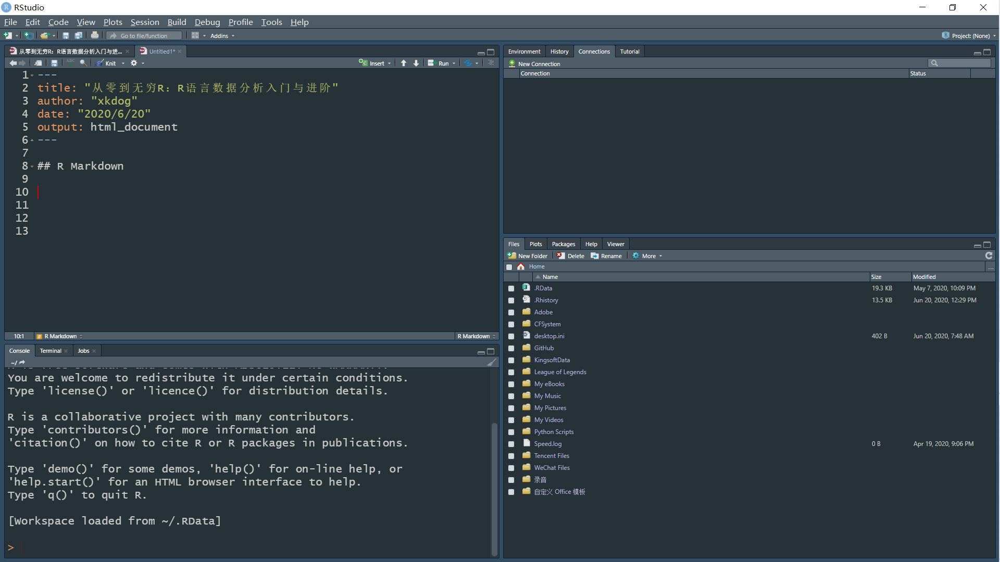
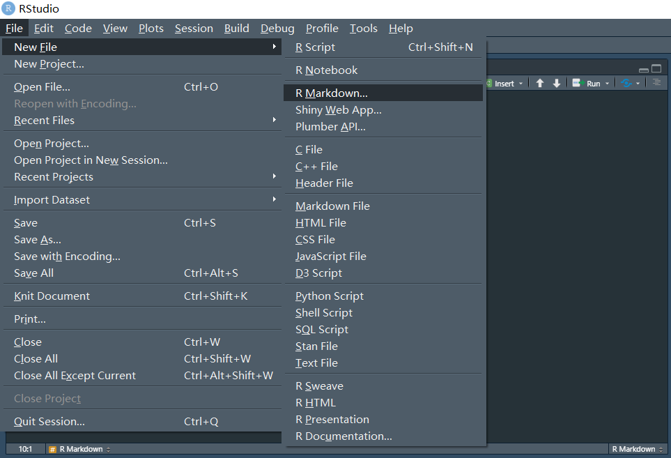
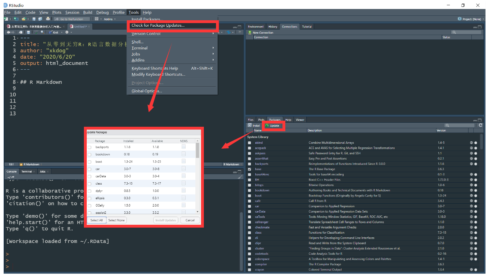
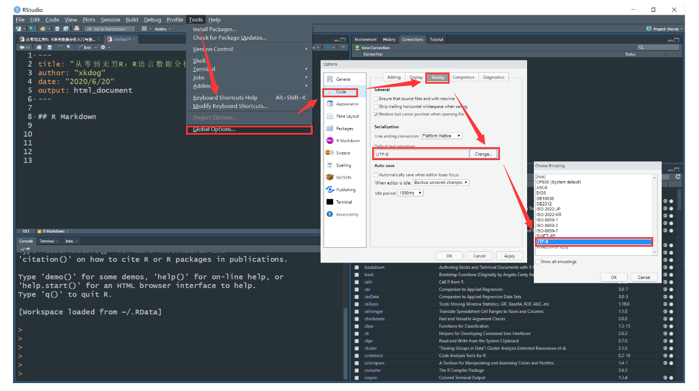
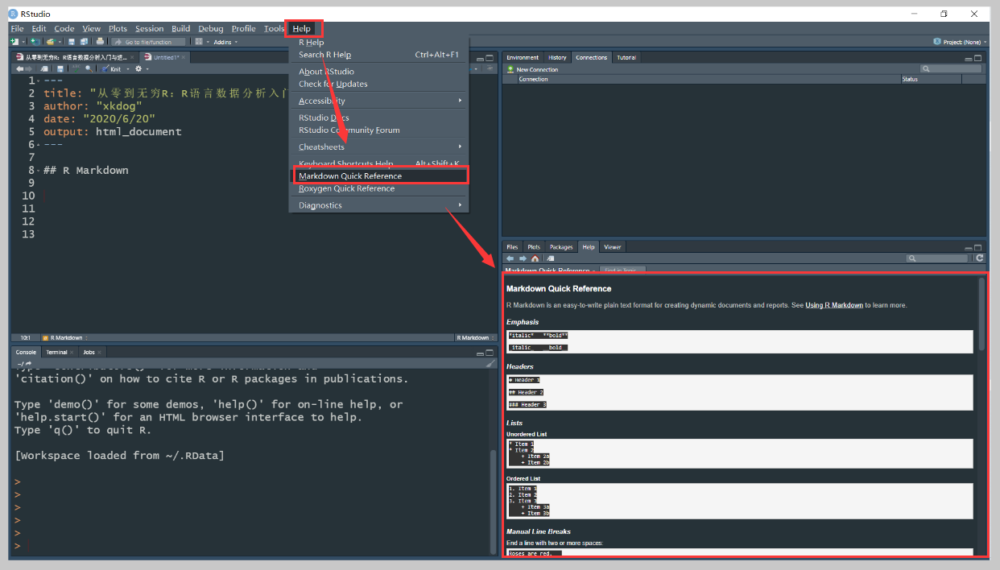
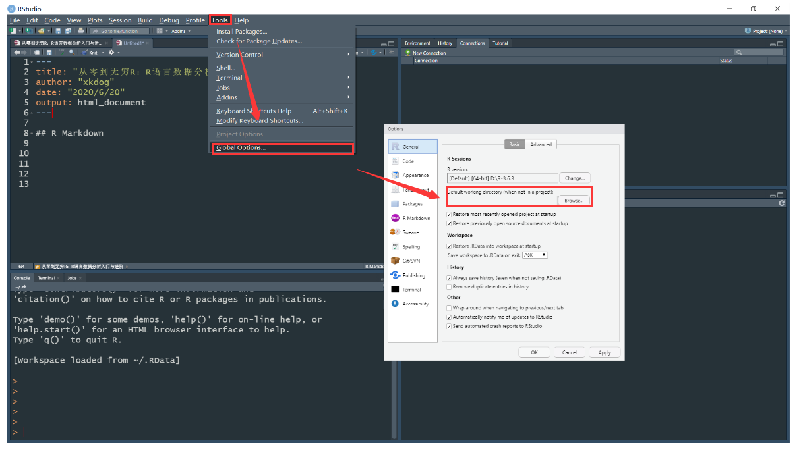
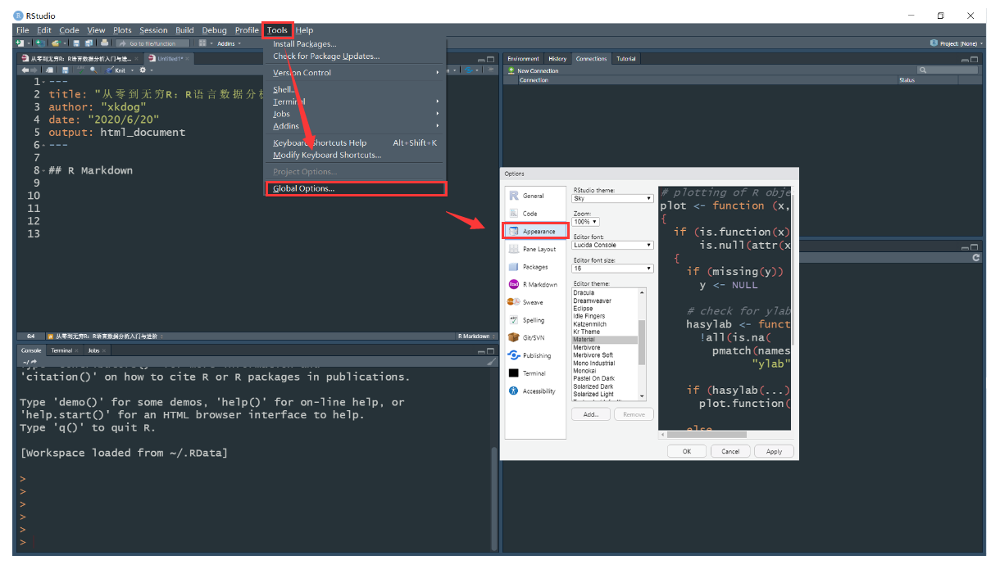

# 1  软件准备

本章主要介绍 R 与 RStudio 的基础知识、安装方式与相关资源。这里所有的示例均以 Windows 10 系统下的 R 4.0.2 版本为例进行，适用于任何 R 4.0.0 以上版本。RStudio 示例适用于 RStudio 1.3 以上版本。本章主要基于 Windows 平台进行图例展示，但相关流程与原理大致适用于 Mac 平台。Linux 用户可能需要另行参考相关的安装与调试教程。

## 1.1  R 安装与调试

R 是一个免费自由且跨平台通用的统计计算与绘图软件，它有 Windows、Mac、Linux 等版本，均可免费下载使用。凭借其开源、免费、自由等开放式理念，R 软件已成为学术研究和商业应用领域最为常用的数据分析软件之一，是新生代统计与绘图工具中的优秀代表。

### 1.1.1  R 简介

R 项目（The R Project for Statistical Computing）最早由新西兰奥克兰大学（Auckland University）的 Robert Gentleman（1959-） 和 Ross Ihaka（1954-） 开发，故软件取两人名字的首字母命名为 R 。该项目始于1993年，2000年发布了首个官方版本 R 1.0.0 ，后期维护由 R 核心团队（[R Core Team](https://www.r-project.org/contributors.html)）负责。截止 2020 年 6 月 22 日，已发布到 4.0.2 版本。

从 [R 主页](https://www.r-project.org/)中选择 [download R](https://cran.r-project.org/mirrors.html) 链接可下载到对应操作系统的 R 安装程序。打开链接后的网页会提示选择相应的 [CRAN](https://cran.r-project.org/mirrors.html) ^[CRAN 是 Comprehensive R Archive Network（R综合典藏网）的简称，它替代 R 核心开发者提供的主程序、源代码和说明文件，也收录其他用户撰写的软件包。]镜像站 ^[镜像站（mirror sites）是网站的复制版本，将网站中的部分网页按原来的结构复制出来，即所谓“镜像”；再将这些镜像放置于具有独立网址的服务器中，以便缓解主站服务器的流量负荷，从而提升访问速率或作为备选网站在主站服务器出现意外时提供正常访问功能。]。目前全球有超过一百个 CRAN 镜像站 ，用户可就近选择镜像站，并据自身偏好选择 Windows、Mac 或 Linux 平台下的最新版本 R 进行安装。

此外，对于 Windows 用户，安装完成 R 后，应再通过以下链接下载安装 [Rtools](https://cran.rstudio.com/bin/windows/Rtools/)，它集成了 Windows 平台下常用的其他实用程序，可增强 R 与其他平台工具的衔接性，对于某些软件包的安装来说也是必不可少的。

### 1.1.2  R 安装与调试

程序下载完毕后，双击安装程序、选择对应的32位或64位程序（若不明白这其中的区别，可选择同时安装）即可安装。初级用户可按默认设置安装在系统盘，并选择一切默认设定完成安装程序。高级用户可根据自身习惯进行相关设置，如安装时去掉版本号以便于日后更新 R 包。

安装完毕后，打开 R ，可看到 R 的操作界面，称为 R 控制台（R Console）。类似其他以编程语言为主要工作方式的软件，R 的界面简洁而朴素，像一个空白的写字板（图1.1）。


在 R 命令提示符`>`后输入相关命令，并摁回车键即可展示相关结果。在不知道任何 R 命令的情况下，也可将 R 作为一个高级科学计算器使用。其数学语法基本与各类计算软件或基础程序类似。

通过一些简单的 R 命令，可更好地了解 R 的风格。例如

```
data()
```

这一命令可展示 R 自带的所有数据集，R 数据的后缀名为`.RData`。注意命令中的`()`是不可缺少的，是 R 命令的有机组成部分。可发现其中有一个`mtcars`数据集。欲了解其内容，可输入如下命令

```
?mtcars
```

`?`表示求助。此时会在默认浏览器 ^[建议使用 Chrome  或 Firefox 浏览器。]中打开一个新的网页，介绍此数据的来源及各变量的具体定义与测量单位。查阅文档可知，`mtcars`数据是从1974年美国《汽车趋势》（Motor Trend）杂志中抽取了32辆汽车的基本性能数据，并对各变量的含义与单位进行了详细说明。以后会利用该数据进行基本展示，读者应花几分钟的时间去了解该数据中各变量的具体含义。以下为 R 自带的数据说明示例。

**Description**

The data was extracted from the 1974 Motor Trend US magazine, and comprises fuel consumption and 10 aspects of automobile design and performance for 32 automobiles (1973–74 models).

**Usage**

mtcars

**Format**

A data frame with 32 observations on 11 (numeric) variables.

  |  |  
:--|:--|:--  
[, 1]	| mpg	| Miles/(US) gallon
[, 2]	| cyl	| Number of cylinders
[, 3]	| disp | Displacement (cu.in.)
[, 4]	| hp	| Gross horsepower
[, 5]	| drat	| Rear axle ratio
[, 6]	| wt	| Weight (1000 lbs)
[, 7] | qsec	| 1/4 mile time
[, 8]	| vs	| Engine (0 = V-shaped, 1 = straight)
[, 9]	| am	| Transmission (0 = automatic, 1 = manual)
[,10]	| gear	| Number of forward gears
[,11]	| carb	| Number of carburetors

直接键入`mtcars`会在 R 中直接展示整个数据。若数据太长，则可能占据太多屏幕空间或消耗太多内存而延长加载时间。如只想直观了解数据的基本结构，使用`head()`命令即可展示某一数据的前几行（默认6行），也可通过以下方式展示指定数据的前若干行

```
head(mtcars, 5)
```

如此即可展示`mtcars`数据前5行。结果中的两个`##`号，表示默认的命令结果提示。相信你很快就能猜出`tail(mtcars, 5)`是何功能。

对中文用户而言，应特别注意 R 命令中所使用的符号全部为英文符号，如果出现中文标点则会出错。另外，如果命令太长需要分行显示，在 R 控制台中会出现`+`号以示连接。但在一些编辑器（如后面要介绍 RStudio ）的命令窗口，并不会出现命令提示符`>`和语句连接号`+`。

### 1.1.3  R 包安装与加载

R 的初始安装程序只包含少数几个基础模块和若干基础安装包（base packages）。所谓 R 包，是 R 函数、数据、预编译代码的特定格式集合，R 中用于存储包的目录称为库（library）。使用函数`.libPaths()`能显示库所在的位置，而使用函数`library()`则可以显示库中有哪些包，在括号中加入包的名称则可加载（load）指定的包。一般应当先加载包再使用包中的相关函数，但使用某些基础安装包中的一些函数（如基础数学和统计函数），不需要通过`library()`函数加载，可以直接使用。

使用基础安装包虽已能完成诸多统计分析与可视化呈现的工作，但往往需要安装并加装其他开放性的软件包来实现更多功能或简化相关的操作流程。这些附加包通常通过 CRAN 镜像站下载安装，并在加载后可调用相关函数执行计算或绘图功能。

一般而言，安装 R 包的方式有三种：（1） CRAN 镜像在线安装；（2）离线安装；（3）GitHub 安装。

**CRAN 镜像安装**

在线安装存放于 CRAN 镜像的 R 包的命令为`install.packages(" ")`，`""`中填入软件包的名称 ^[遵从 R 开发者的书写惯例，在描述 R 命令的名称时也应带上小括号`()`，以表示这是一个 R 命令。]。例如，在 R 命令窗口（即所谓的 R 控制台）中的`>`符号后输入如下命令

```
install.packages("dplyr")
```

确保电脑联网。每次重新打开 R 后，首次安装包时会要求选择镜像站。就近选择国内镜像，如常见的清华大学镜像站、中国科学技术大学镜像站、兰州大学镜像站等，点击确定即可在线安装软件包**dplyr**。其中的双引号`""`也可使用单引号`''`替换。安装成功后应出现如下提示

```
package ‘dplyr’ successfully unpacked and MD5 sums checked
```

在`install.packages()`命令中不能省略双引号或单引号，否则会出现如下错误提示

```
Error in install.packages : object 'dplyr' not found
```

若想一次性安装多个包，可使用如下方式

```
install.packages(c("Package A", "Package B"))
```

即使用`c()`将不同的包加以联接，中间加上逗号。字母`c`的含义其实正是联结（concatenate，或理解为 combine 更容易记忆）。如一次性安装的包比较多，可能需要几分钟左右的时间才能安装完毕，最终所需时间视网络状况及个人电脑配置而定。有时会遇到在某一镜像站下无法成功安装 R 包的情况，可在 R 中通过`Packages-->Set Cran Mirror`菜单路径选择更换不同镜像站，重新尝试安装，直至成功。

**离线安装**

由于网络问题，在线安装有时可能出错，此时可选择离线安装。

离线安装首先要求有相关 R 包的压缩包。如已确定所想安装的包名，在 CRAN 网站上选定镜像站后，点击左侧的 Packages 一栏，可看到所有在该网站上储存的 R 包。点击 R 包名称进入相关页面，找到 Windows Binaries 一行对应的`.zip`文件，下载到本地电脑（Mac 系统选择`.tgz`文件）。该文件无需解压缩，打开 R 后，遵循以下路径安装该压缩包`Packages-->Install package(s) from local files`，点击后选择安装包即可完成安装。

离线安装的问题在于，有些 R 包的功能依赖于另外一些包，因此需要同时安装其所依赖的其他包。采用离线安装时无法加载这些包。

**GitHub 安装**

存放于 CRAN 上的包通常是较为成熟、某种程度上讲也是相对滞后的包。包在维护和更新过程中会增加一些新的功能，或者总会有一些新的试验性的包出现，以满足用户的功能。这些旧包的更新版、或者是未曾公开推出的新包，通常会以开发版（development version）的形式储存于类似 [GitHub](https://github.com/) 这样的代码托管平台 ^[GitHub 是一个面向开源及私有软件项目的托管平台，于2008年4月10日正式上线，是目前全球规模最大的社会化编程及代码托管网站。]，而并未提交到 CRAN 。甚至有开发者本人并无意向将自身开发的 R 包提交至 CRAN 镜像。此时，前述两种安装方式就不再有效。

若想直接从 GitHub 安装相关包，建议通过**devtools**包完成安装。以下是基本步骤：

1. 安装**devtools**包（请复习并实践第一种安装法）。
2. 加载该包，即输入`library(devtools)`。
3. 使用其中的`install_github()`函数完成安装。

以下是示例

```
install.packages("devtools")
library(devtools)
install_github("hadlley/dplyr")
```

`install_github()`命令通常要求先给出开发者名字再给出包名。这对于只知道包名而不知道开发者名字的用户是不利的。好在使用这一安装方式的通常为中高级用户，他们自可从 GitHub 页面找到相关包并阅读其安装说明后安装。

为更好地利用 GitHub 及 R 的相关功能，同时建议 Windows 用户安装[`Rtools`工具](https://cran.r-project.org/bin/windows/Rtools/)。这是用于在 Windows 平台下开发 R 包和 R 本身的软件插件。


除此之外，还有一些 R 包存放于 [Biocondutor](https://www.bioconductor.org/) 等网站，适用于生物学相关专业的用户进行更为定制化的安装。

### 1.1.4  R 包加载与使用

使用 R 内置的少数函数以及**base**这个包中的函数进行数据分析时，直接调用函数即可，无需先加载。**base**包所包含的函数可使用如下命令查看

```
help(package = "base")
```

但多数函数都在其他包中。若要使用这类函数进行数据分析，首先要加载这些包。这有两种方式。

一是使用加载命令`library()`，此时包的名称不需要加引号。例如

```
library(dplyr)
```

此时会出现如下显示

```
载入程辑包：‘dplyr’

The following objects are masked from ‘package:stats’:

    filter, lag

The following objects are masked from ‘package:base’:

    intersect, setdiff, setequal, union
```

此中内容先不加过多解释，其基本要点是：加载此包之后，即可使用此包中的`filter()`、`lag()`等函数，而原基础安装包中的同名函数则会被最近一次引入的包中的函数所覆盖（即失效）。

二是使用双冒号`::`的形式调用某一函数，其用法为`package_ name::function_name`，即先写包名，双冒号后写入函数名称，即可调用该包中的这一函数。

```
dplyr::sample_n(mtcars, 2)
```

上述命令表示，使用**dplyr**包中的`sample_n()`函数，从`mtcars`数据中任取两行。

退出 R 时无需先“退出”包再退出 R ，保存数据对象后直接关闭 R 即可。

### 1.1.5  工作目录设置

R 默认读入和写出的数据对象都存储在当前工作目录（working directiory）中。若要读入其他目录中对象，则需指定工作路径。一般而言，开始某个数据分析项目时，即可新建一个目录并将其设定为当前工作目录。此后所有的数据对象均储存其中。

对中文操作系统用户而言，为避免因汉字编码问题而在读入文件和分析数据时发生莫名的错误，首先需要明确一条**基本命名规则**：R 中的目录名和文件名不能有中文，也不要出现除中划线 `-` 和下划线 `_` 之外的特殊字符，而只使用英文字母、数字以及 `-` 和 `_` 的组合。

对普通用户而言，建议在非系统盘（如 D 盘、E 盘等）的根目录下建立数据分析目录。创建新目录可直接在操作系统中进行，也可在 R 中使用命令`dir.create(" ")`建立新目录，`" "` 中输入路径名和目录名，例如

```
dir.create("D:/R2020")
```

此时即可在 D 盘根目录下找到名为 R2020 的目录。

**注意：**R 中的路径分隔符为正斜杠（forward slash）`/`，而不是反斜杠（backward slash）`\`。正反斜杠的译法多少有些令人费解，日常交流中不妨自行取名为撇斜杠（`/`）和捺斜杠（`\`），或更适合中国人的理解方式。本书以后均从此例。

如目录已创建，可通过命令`setwd()`将该目录设为当前工作路径，例如

```
setwd("D:/R2020/course01")
```

其中`wd`即 working directory 的首字母缩写。

R 路径名中的撇斜杠`/`也可写成双捺斜杠`\\`的形式，如

```
setwd("D:\\R2020\\course01")
```

设置完毕后，可通过`getwd()`命令查看当前工作路径，此时括号中不需要填入任何内容。

### 1.1.6  语言选项设置

R 中默认的中文提示最早并非由中国大陆用户翻译，其翻译用语可能不能与简体汉字完全对应。此外，中文 R 社区在活跃度和技术水平上与国外的成熟社区还有较大距离，按中文提示进行网络搜索学习通常不能找到很好的资源。因此，安装完 R 后，可考虑修改默认语言选项，将其设为英文。

若想使修改后的语言选项仅对此次打开的 R 有效，可使用如下命令

```
Sys.setenv(LANG = "en")
```

`Sys.setenv()`是修改环境变量函数，`LANG`表示语言（language），`en`表示英语（English）。这样在将来出现错误提示时，可使用搜索引擎检索到相关解答资源。注意应当使用英文搜索引擎来搜索英文资源，以提高效率。

这种做法的不足在于关闭 R 而重新打开后，其默认语言选项仍是中文。对中国大陆的 Windows 用户而言，可采用如下方式永久改变对应版本 R 的默认语言：

1. 找到安装路径下`etc`文件夹中的`Rconsole`文件。如选择默认安装方式，R 通常安装在 C 盘的 Program Files 目录下。以本书写作此文档时的 R 版本为例，其路径为：`C:\Program Files\R\R-4.0.2\etc`。

2. 用文本编辑器打开`Rconsole`文件。建议安装 [Notepad++](https://notepad-plus-plus.org/) 软件而不是使用 Windows 自带的记事本软件打开^[Notepad++ 也是一个免费的自由开源软件。之所以推荐使用它而不是Windows自带的记事本，原因比较复杂，涉及计算机的字符编码问题，暂不必深究。如有可能，在涉及代码写作时，Windows 平台下宜尽可能使用 Notepad++ 而不是其自带的记事本软件创建或修改文本文件。若是 Mac 系统，可使用 [Sublime](https://www.sublimetext.com/) 软件或其他开源文本编辑器打开。]。找到以下文字

```
## Language for messages
language = 
```

3. 通常来说，`=`号后面默认是空白，以便调用 Windows 的默认语言。在 `=`后填入指定的语言缩写，保存修改后关闭该文档，即可永久性修改默认语言设置。例如

```
## Language for messages
language = en
```

其中`en`表示 English 。保存后关闭（Windows 系统可能会提醒需要管理员权限方可修改，点击确定），重新打开 R ，应当可以看到所 有提示文字已变为英文

```
R version 4.0.2 (2020-06-22) -- "Taking Off Again"
Copyright (C) 2020 The R Foundation for Statistical Computing
Platform: x86_64-w64-mingw32/x64 (64-bit)

R is free software and comes with ABSOLUTELY NO WARRANTY.
You are welcome to redistribute it under certain conditions.
Type 'license()' or 'licence()' for distribution details.

R is a collaborative project with many contributors.
Type 'contributors()' for more information and
'citation()' on how to cite R or R packages in publications.

Type 'demo()' for some demos, 'help()' for on-line help, or
'help.start()' for an HTML browser interface to help.
Type 'q()' to quit R.

[Previously saved workspace restored]
```

实际上，对有经验的 Windows 用户来说，设置 R 的默认语言为英文的最简便方式是在安装 R 时，出现`Select Components`对话框后，将里面出现的`Message Translation`选项前面默认出现的勾去掉，即可保证界面和提示语言为英文。你不妨在安装新版本的 R 时尝试这种方法。无论如何，应尽快熟练英文环境下的相关操作，以提升 R 的使用效率。

## 1.2  RStudio 安装与调试

R 虽然强大，但仍欠缺完成数据分析的整体流程所需要的衍生功能。例如，如何满足普通用户对友好操作界面的需求，如何生成可重复、交互性的报告（Word 格式、HTML 格式或其他格式）并与他人共享，如何快速导入其他类型的数据（如 Excel、SPSS、Stata、SAS 等常用数据管理与分析软件格式的数据），等等。这就需要一个更具整合性的操作平台，以更有效率和对普通用户更友好的方式完成数据分析、报告撰写、成果发布等工作。这里主要介绍 RStudio 这一工具，此外还有其他优秀的集成工具可供使用，如[VisualStudio](https://visualstudio.microsoft.com/zh-hans/)、[Eclipse](https://www.eclipse.org/ide/)、[Jupyter Notebook](https://jupyter.org/) 等，但限于篇幅不再介绍。

### 1.2.1  RStudio 简介

RStudio 是集成了 R 软件、带语法高亮和命令补全的代码编辑器、画图工具、代码调试工具等内容的集成开发环境 ^[集成开发环境（Integrated Development Environment，IDE）软件是用于程序开发的应用程序，一般包括代码编辑器、编译器、调试器和图形用户界面工具，集成了代码编写、分析、编译、调试、建模等功能的一体化开发软件套。]。它同样提供 Windows、Mac 和 Linux 版本，同时具有免费的开源版本和付费的商业版本供用户选择。个人用户或普通用户选择免费版本即可，具有更高要求的企业用户或高级用户可选择商业版本。RStudio 的开发始于2010年，2011年2月发布测试版，2020年发布1.3.959版本。此后介绍均以 RStudio 1.3.959及其之后的版本为基础进行演示。

RStudio 的[核心团队](https://rstudio.com/about/)包括以首席科学家 [Hadley Wickham](http://hadley.nz/)为代表的其他数据科学家和软件工程师，他们是驱动 R 与数据科学进一步发展和推广的活跃力量，其所开发的诸多 R 包已成为数据分析的常用工具。

RStudio 可从其[官网](https://www.rstudio.com/products/RStudio/)，选择对应系统的版本下载安装。安装选择默认选项即可，注意一般应在安装完 R 后再安装 RStudio。

### 1.2.2  RStudio 调试

**布局与功能**

RStudio 界面由上方的工具栏与下方的四个小窗口组成（图1.2）。



* 左上角的命令区，用来编辑、粘贴命令,窗口上部的小图标是较为常用的几个功能，如保存( `Save current document` )、 `Knit` ^[Knit 功能可根据数据处理结果生成所需格式的文档，如 HTML、PDF、Word 等。]、运行( `Run` )；
* 左下角的控制区( `console` )^[控制区显示脚本运行结果，亦可直接输入命令，回车运行。]；
* 右下角的功能区，依次为 `Files` (打开本地文件)、 `Plots` (显示图形结果)、 `Packages` (包的相关功能)、 `Help` (帮助)、 `Viewer` 五个功能；
* 右上角的 `Environment` 与 `History` ，分别用来对数据与已运行的命令进行显示和操作。

**新建文档类型**

在 `File` 菜单下的 `New File` 子菜单里可看到所有可新建文档类型，点击 `R Script` 可新建一个空白文档，此外还有`R Notebook`、`R Markdown`、`C++ File` 文档等，甚至还可创建`python`文档（图1.3）。



**数据导入**

通过 `File` 菜单下的 `Import Dataset` 即可进行数据的导入，可导入 CSV、Excel、SPSS、SAS、Stata 五种格式的文件。导入的文件会在命令区以新窗口的形式呈现。导入这些外部数据一般需要提前安装一些指定用包。


**包的更新**

软件使用中经常会有 R 包的更新，可以通过 `Tools` 菜单下的 `Check For Updates` 功能检查待更新的 R 包，也可以直接点击右下角 `Packages` 功能区的 `Update` 按钮，功能相同（图1.4）。



**默认文本编码格式**

为了避免打开数据文件时中文变成乱码，需要修改默认文本编码格式，点击 `Tools` 菜单下的 `Global Options` 子菜单，在弹出窗口中点击 `Code` 中的 `Saving` ，将默认文本编码格式(Default text coding)修改为 UTF-8^[UTF-8(8-bit Unicode Transformation Format)又称万国码,由Ken Thompson于1992年创建,用在网页上可以统一页面显示中文简体繁体及其它语言。]。当打开中文数据时在 `File` --> `Reopen with Ecoding` 下选择 UTF-8 格式就可以正常显示中文（图1.5）。



**速查表**

为方便 RStudio 的使用， `Help` 菜单内设置了 `Cheatsheet`（速查表） 提供一系列的快捷入门文档，以及 RStudio 编辑器的一般语法 **R markdown** 的基本格式（图1.6）。



此外，还可通过访问[RStudio 官方网页](https://rstudio.com/resources/cheatsheets/)下载这些制作精美的速查表。


对初级用户而言，RStudio 的最初调试一般只涉及 `Tools` 菜单下的 `Global Options` 子菜单。打开后，在 `General` 选项中可选择与 RStudio 相关联的 R 版本（如果只安装了一个版本的 R，此步骤可忽略），还可设定当前工作目录（图1.7）。



当前工作目录的设置非常重要，稍后继续说明。在 `Appearance` 选项中可选择字体、字号和背景颜色，可自行尝试调整到个人觉得舒适的配置（图1.8）。


其他调试可参考 RStudio 官网上的[教程](https://education.rstudio.com/)自行探索。

### 1.2.3  RStudio 功能简介

为确保能实现 RStudio 的诸多拓展功能，请确保已安装 **tidyverse** 包。这一安装过程会自动安装诸多相关联的包，成功后可完整地展示 RStudio 的相关功能。

打开 RStudio，点击左上角的新建空白文档图标的向下箭头，可以看到可供选择的新建文档格式包括 R script、R Notebook、R Markdown 等。一般可选择 R Markdown 为基本文档格式。以下如无特殊说明，均以此格式为准进行演示。

如想观察数据，可键入如下命令

```
View(mtcars)
```

此时左上方窗口会出现数据结构示意，并可执行数据排序（点击变量名称中的上下箭头按钮）、筛选（点沙漏形状的 `Fitler` 按钮）等简单功能。

### 1.2.4  RStudio 中的常用快捷键

要想流畅运用 RStudio，常用快捷键的使用是必不可少的。下面列举几个较常用的快捷键。
<style type="text/css"> table { width: 340px; text-align:center } </style>
| **功能** |	**Windows** |	**Mac** |
| :----: | :----: | :----: |
|控制区清屏| 	Ctrl + L |	Command + L |
|新建文档| 	Ctrl + Shift + N |	Command + Shift + N |
|打开文档| 	Ctrl + O |	Command + O |
|保存当前文档| 	Ctrl + S |	Command +S |
|关闭当前文档| 	Ctrl + W |	Command + W |
|关闭所有文档| 	Ctrl + Shift + W |	Command + Shift + W |
|转换为HTML| 	Ctrl + Shift + H |	Command + Shift + H |
|运行当前行| 	Ctrl + Enter |	Command + Enter |
|运行当前代码块| 	Ctrl + Alt +C / Ctrl + Shift + Enter |	Command + Alt +C / Command + Shift + Enter |
|插入空代码块| 	Ctrl + Alt + I |	Command + Alt + I |
|补全选中区域空格| 	Ctrl + Shift + A |	Command + Shift + A |
|复制| 	Ctrl + C |	Command + C |
|粘贴| 	Ctrl + V |	Command + V |
|剪切| 	Ctrl + X |	Command + V |

在 RStudio 内可通过工具栏 `Help / Tools` --> `Keyboard Shortcuts Help` 或快捷键`Alt+Shift+K` 来查看所有快捷键（图1.9）。


按任意键可退出此屏幕。

## 1.3  tidyverse 代码风格与相关 R 包

**tidyverse**一词中的`tidy`意为整洁，`verse`意为诗篇、诗行，合起来意指代码或数据如诗行般整洁易读，即成为“整洁代码”（tidy code）或“整洁数据”（tidy data）。目前，**tidyverse**有两层基本含义：（1）基于 Google 社区的 R 代码风格（[Google’s R style guide](https://google.github.io/styleguide/Rguide.xml)）衍生的一种使代码清晰可读的编程风格；（2）一系列基于前述风格而编写的数据处理 R 包。熟悉这一风格和相关 R 包，可使数据处理和代码编写过程更为便捷高效，且易于与其他数据分析者交流沟通。

### 1.3.1  **tidyverse** 代码风格


建立较为统一的代码书写风格，可方便不同用户之间的沟通与协作。这里基于[**tidyverse**](https://www.tidyverse.org/)模式择要介绍目前 R 编程中的主流风格，并根据中文用户的习惯做部分调整和说明。某些内容可能初级用户并不一定很快遇到，但仍宜先行阅读，以建立良好的书写规范。详细的**tidyverse**风格说明参见如下链接

<http://style.tidyverse.org>

此外，**tidyverse** 语法风格，可与 **R Markdown** （参见本书附录1）的相关风格匹配学习，从而熟悉 R 社区的主流风格。

### 命名规范


#### 文件名

文件名应能体现文件的实质内容，只使用数字、英文字母、中划线`-`和下划线`_`。尽量避免文件名中的英文字母大小写混用，宜只使用小写，并建议使用`_`或`-`连接文件名中的不同英文，如`nankai_psy_2018`。

若多个文件存在特定顺序，应以数字作为前缀。如果有超过10个文件，对于个位数的前缀要在前面添补一个0。例如

```r
00_student.xx
01_faculty.xx
...
09_university.xx
10_city.xx
```
其中，`.`后的`xx`表示适当的文件后缀名，可能是`csv`、`xlsx`、`pdf`、`png`等。

超过100个文件则在最开始补充00，依此类推。


#### 变量与函数名

变量和函数名应只使用小写字母、数字和下划线`_`。下划线用于分隔较长命名中的不同单词，避免用`.`分隔。例如，变量名写成`bmi_women`，而不是`bmi.women`；函数名写成`trim_gini`，而不是`trim.gini`。变量名应是名词，而函数名应是动词，且应尽量简洁。

#### 赋值

尽量使用`<-`而不是`=`进行对象赋值。

```r
a <- rnorm(10)
```

`=`号宜只用于参数传递。

```r
plot(x, y, col = " ", lty = " ", lwd = " ")
```

### 写作语法

#### 空格

汉语写作中基本无须注意空格，但在英文书写和编程中正好相反。在适当的地方插入空格，可使文本和代码整洁美观，务必引起重视。

`=`、`+`、`-`、`<-`这四个符号两侧需要有一个空格（注意`<-`中间本身并无空格）。与正常英文书写一样，逗号后面（而不是前面）应有空格。

```r
mtcars_renamed <- rename(mtcars, x = mpg)
```

但是，`:`、`::`和`:::`两侧不需要空格。

```r
a <- 1:20
seq(1:20)
```

小括号`(`的前面需要加空格，调用函数时除外。

```r
if (major == "PSY") show(student_id)
```

在多行命令中，为保证行与行之间的对齐和美观，`=`号或赋值符号`<-`，可使用多个空格。

```r
rank = cut(
  breaks = c(0, 59, 69, 79, 89, 100),
  right  = TRUE
)
```

#### 缩进

通常不用制表符（Tab 键）进行缩进，而用两个空格进行缩进。


R 中用花括号`{}`定义 代码层级。`{}`内的每行代码前应缩进两个空格。大括号的左半边`{`不能独占一行，其后应另起一行。右半边`}`应独占一行，除非后面有`else`或`)`。

```r
if (x > y) {
  if (x > z) {
  message("x is good")
  } else {
  message("x is not good")
  }
} else {
message("x is not good")
}
```

若`if`语句非常简单，仅占一行，可不使用花括号。例如

```r
x <- 5
y <- if (x < 10) "Too low" else "Too high"
```


#### 行宽

每行代码宜不超过80个字符。若代码超出这一长度，应尽量将一些功能打包成独立的函数。

若代码太长，不能写成一行，宜分行编写。可以一行写函数名，一行写参数，右括号`)`单起一行。这样的代码可读性更强，也便于修改。例如

```r
mutate(women, 
       height_cm = height * 2.54, 
       weight_kg = weight * 0.45
       )
```

若参数之间关系密切，可以将几个参数放在同一行中，例如用`paste()`或`stop()`调用字符串。如有可能，生成字符串时要将一行代码和它的输出放到同一行中。

不要把分号`;`放在行尾，也不要用它分隔同一行的多条命令。

#### 管道操作

当将三个或更多的函数嵌套调用，或者创建无须关心的中间对象时，要使用管道操作符：`%>%`，其含义是将上一个函数的结果传递作为下一个函数的操作对象。`%>%`的前面应有一个空格，后面的代码应另起一行。若一个函数的所有参数不能同时在一行中，则在每行放置一个参数并且缩进。完成第一步后，每一行都应缩进两个空格。即使某一步的管道操作可以省略对象，也应在函数名后加上`()`。参见如下示例

```r
mtcars %>%
  select(am, mpg) %>%
  arrange(am, mpg) %>%
  group_by(am) %>%
  summarise(
    n = n(),
    mpg_mean = mean(mpg),
    mpg_sd = sd(mpg),
    mpg_median = median(mpg)
  ) %>%
  round()
```

如果需要操纵不止一个对象，或者中间对象具有实际意义且后面需要加以调用时，应避免使用管道操作。虽然在管道操作的最后可用`->`赋值，但应尽量避免这一做法，以增加代码的可读性。


#### 注释

每行注释都以`#`号开始，`#`号后需要加一个空格。

可使用由`-`和`=`构成的注释行将文件分割成容易理解的段落。

```r
# select data ---------------------------

# arrange data ---------------------------
```


### 1.3.2  **tidyverse** 包简介

作为 R 包的 **tidyverse** 集合了当下最为流行的数据处理包，是简化数据操纵、便利统计操作、美化结果呈现的高效工具。

#### 基本理念

整洁数据是 Hadley 等人极力提倡的一个数据处理理念。若要执行统计计算，统计软件对数据格式有一定要求。但通常外部导入的数据并不一定能达到软件处理的要求，而需要进行一定的预处理，此过程通常也称为数据清洗（data cleaning）。实际上，这种前期处理的工作往往占据比狭义的统计分析更多的时间。为此，需要将杂乱数据（messy data）整理成可供计算机程序识别与处理的、具备特定格式的数据，即整洁数据，其基本特征有三：

1. 每列为一个变量（Each variable is in a column）；
2. 每行为一个观测（Each observation is in a row）；
3. 每个单元格为一个取值（Each value is a cell）。

  
这些特征在后面的例子中会逐一呈现，这里暂不展开。分析者获得的数据有些本身就适宜软件分析，但很多时候并非如此。使用 **tidyverse** 包，可高效地将无序数据转为整洁数据，以便软件分析。


#### 安装与加载

安装 **tidyverse** 包，即可一次性安装多个系列包。具体如下

```r
install.packages("tidyverse")
```

此命令将安装如下包：

- 最常用数据分析包：
    - **ggplot2**，用于数据可视化
    - **dplyr**，用于数据操纵
    - **tidyr**，用于数据整洁
    - **readr**，用于读入 R 格式数据
    - **purrr**，用于编程
    - **tibble**，用于形成便于数据处理的数据框

- 数据操纵类：
    - **stringr**，用于处理字符串数据
    - **lubridate**, 用于处理日期和时间数据
    - **forcats**，用于处理因子数据

- 数据导入类：
    - **DBI**，用于联接数据库
    - **haven**，用于读入 SPSS、SAS、Stata 数据
    - **httr**，用于联接网页 API
    - **jsonlite**，用于读入 JSON 数据
    - **readxl**，用于读入 Excel 文档
    - **rvest**，用于网络爬虫
    - **xml2**，用于读入 xml 数据

- 数据建模类：
    - **modelr**，用于使用管道函数建模
    - **broom**，用于统计模型结果的整洁

安装成功后，可通过常规方式加载 **tidyverse** 包，结果如下

```{r, warning=FALSE}
library(tidyverse)
```

开始数据分析时，不论是否用到，可先加载 **tidyverse** 系列包，以便后续工作。此后将对此系列包中的重点 R 包展开详细介绍。


## 1.4  本章习题


1. 安装 R、Rtools（仅限Windows 用户）和 RStudio 并完成基础调试。安装 **tidyverse** 包并尝试加载。

2. 学习 **tidyverse** 语法风格，同时学习附录中的 **R Markdown** 语法。

3. 在 RStudio 中创建 R Markdown 文档，并使用 **R Markdown ** 语法完成如下表格的制作，最将其编译成一个 HTML 文档并观察其效果。

姓名  |  专业  |  学号  |  性别
:-----|:-------|:-------|:-----
张文理| 社会学 | 2021101| 男
徐弱水| 心理学 | 2021202| 女
刘子睿| 经济学 | 2021303| 男
洪依凡| 管理学 | 2021404| 女

4. 浏览[Bookdown](https://bookdown.org/)官网并阅读自身感兴趣的技术文档，培养对 R 语言的兴趣，了解其多元用途。


